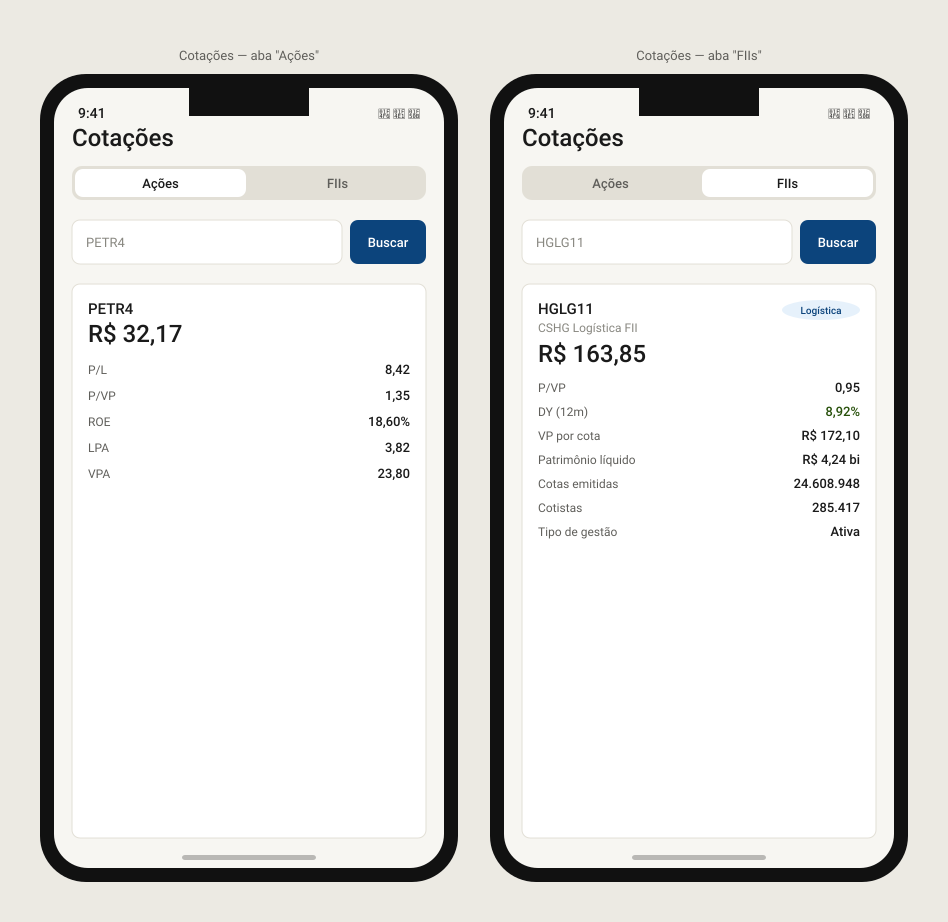

# stockapp-quotes

Kotlin Multiplatform (KMP) + Compose Multiplatform module of [StockApp](https://github.com/dgbarreto/stockapp-app) — an investment tracking app (learning project).

Domain + data (client for [`stockapp-backend`](https://github.com/dgbarreto/stockapp-backend), which proxies the bolsai market data API) and Compose screens for searching/viewing quotes and fundamental indicators for both stocks and REITs (FIIs).

## Screens

`AssetQuotesScreen` — a single screen with a segmented control to switch between **Stocks** and **FIIs**, each with its own search field and indicator card:



## Structure

- `quotes/` — the only module in this repo, targeting Android (via `com.android.kotlin.multiplatform.library`) + iOS (static framework `Quotes`), shared code in `quotes/src/commonMain`.
- `sample/` + `sample-android/` — dev-only sample apps (Android + Desktop) that log in via `stockapp-auth` and hit the real backend, used to validate the module in isolation.

## What's in it

- **Domain/data**: `QuotesApiClient`/`FiisApiClient` (Ktor), repositories, and DTO↔domain mappers that normalize the casing differences between backend endpoints.
- **Presentation**: `QuotesViewModel`/`FiisViewModel`, `QuoteContent`/`FiiContent`/`FiiCard`, composed together in `AssetQuotesScreen`. Built with `stockapp-designsystem` components (`StockAppCard`, `StockAppKeyValueRow`).

## Status

Fully implemented — stock quotes (P/L, P/VP, ROE, EPS, book value per share) and FII quotes (P/VP, 12-month dividend yield, book value per share, shares outstanding, shareholders, management type) are both live. Published to GitHub Packages, backend endpoints protected with JWT, and integrated into `stockapp-app`'s Quotes tab.

## Stack

- Kotlin 2.4.0 · Compose Multiplatform 1.11.1 · AGP 9.0.1 · Ktor Client 3.5.0 · kotlinx.serialization 1.11.0

## Running

```
./gradlew :quotes:build
./gradlew :quotes:testAndroidHostTest
./gradlew :quotes:iosSimulatorArm64Test
```

---

_Progress kept up to date manually as the project moves forward._
